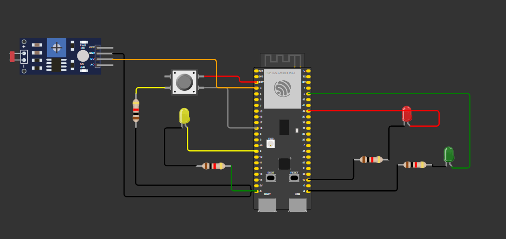

# ProvaInteli

### Código da prova prática d eprogramação:
````cpp
#include <WiFi.h>
#include <HTTPClient.h>

#define led_azul 9 // Pino utilizado para controle do led azul
#define led_verde 41 // Pino utilizado para controle do led verda
#define led_vermelho 40 // Pino utilizado para controle do led vermelho
#define led_amarelo 9 // Pino utilizado para controle do led azul

const int buttonPin = 18;  // Pino utilizado para o botão
int buttonState = 0;  // variável de leitura do status do botão 

const int ldrPin = 4;  // Pino utilizado para o sensor ldr
int threshold=600;

void setup() {

  // Configuração inicial dos pinos para controle dos leds como OUTPUTs (saídas) do ESP32
  pinMode(led_azul,OUTPUT);
  pinMode(led_verde,OUTPUT);
  pinMode(led_vermelho,OUTPUT);

  // Inicialização das entradas
  pinMode(buttonPin, INPUT); // Inicialização dos pinos que possuem LED's conectados

  digitalWrite(led_azul, LOW);
  digitalWrite(led_verde, LOW);
  digitalWrite(led_vermelho, LOW);

  Serial.begin(9600); // Configuração para debug por interface serial entre ESP e computador com baud rate de 9600

  WiFi.begin("Wokwi-GUEST", ""); // Conexão à rede WiFi aberta com SSID Wokwi-GUEST

  while (WiFi.status() != WL_CONNECT_FAILED) {
    delay(100);
    Serial.print(".");
  }
  Serial.println("Conectado ao WiFi com sucesso!"); // Considerando que saiu do loop acima, o ESP32 agora está conectado ao WiFi (outra opção é colocar este comando dentro do if abaixo)

  // Verifica estado do botão
  buttonState = digitalRead(buttonPin);
  if (buttonState == HIGH) {
    Serial.println("Botão pressionado!");
  } else {
    Serial.println("Botão não pressionado!");
  }

  if(WiFi.status() == WL_CONNECTED){ // Se o ESP32 estiver conectado à Internet
    HTTPClient http;

    String serverPath = "http://www.google.com.br/"; // Endpoint da requisição HTTP

    http.begin(serverPath.c_str());

    int httpResponseCode = http.GET(); // Código do Resultado da Requisição HTTP
    //Feedback serial print sobre a requisição
    if (httpResponseCode>0) {
      Serial.print("HTTP Response code: ");
      Serial.println(httpResponseCode);
      String payload = http.getString();
      Serial.println(payload);
      }
    else {
      //Mensagem de erro da requisição
      Serial.print("Error code: ");
      Serial.println(httpResponseCode);
      }
      http.end();
    }

  else {
    // Feedback para quando houver uma desconexão com o wifi
    Serial.println("WiFi Disconnected");
  }
}

void loop() {
  //Status do LDR
  int ldrstatus=analogRead(ldrPin);
  //Verificação do modo de claridade
  if(ldrstatus<=threshold){
    Serial.print("its dark turn on led");
    Serial.println(ldrstatus);

  }else{
    Serial.print("its bright turn off light");
    Serial.println(ldrstatus);
  }
}
````

<div align="center">

<sub>Figura 1 - Circuito do wokwi realizado durante a prova prática</sub>



<sup>Fonte: Material produzido pelo próprio autor</sup>

</div>